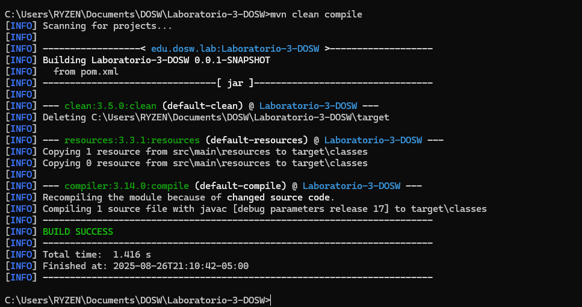
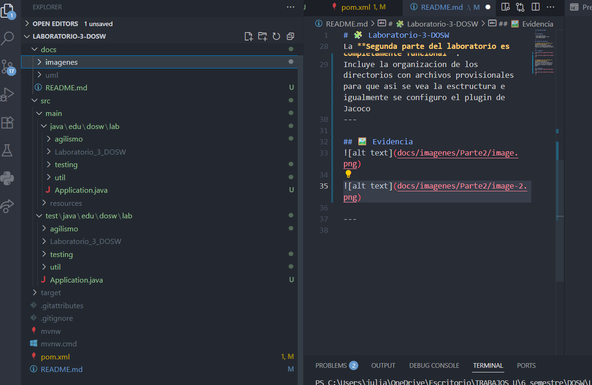
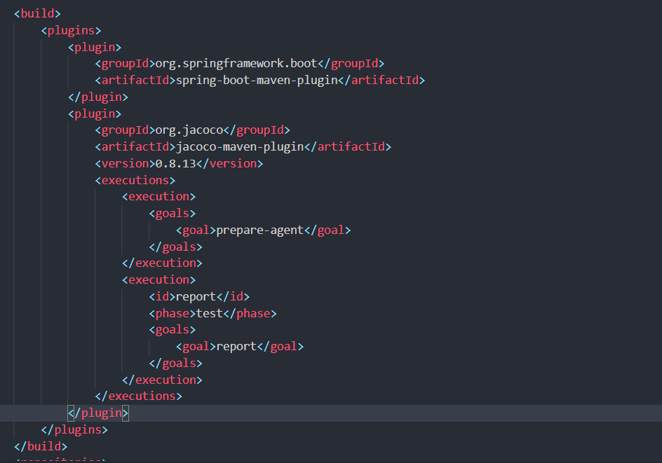
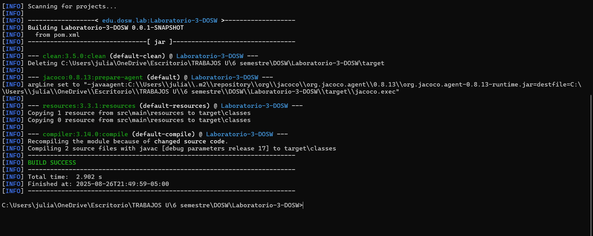
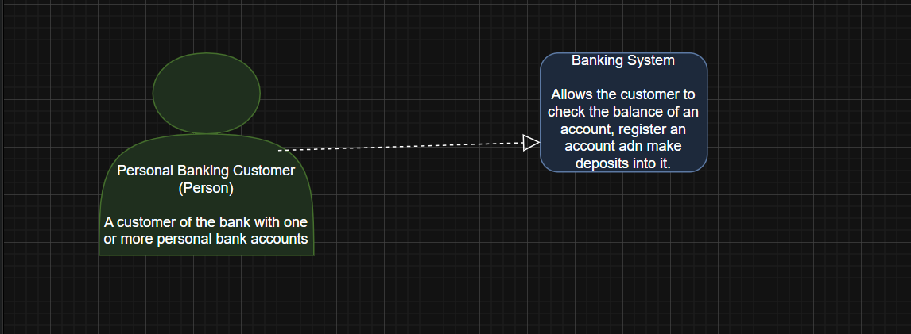
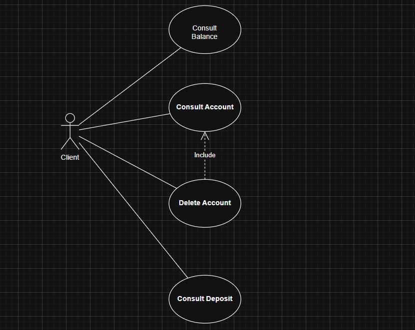

# 🧩 Laboratorio-3-DOSW

---

## 👥 Integrantes

- Julian Lopez Barrero
- Juan Sebastian Puentes Julio
- Tulio Riano Sanchez

---

## ✅ Estado del Laboratorio

La **primera parte del laboratorio es completamente funcional**.  
Incluye la configuración básica de Maven, la estructura del proyecto y la inclusion de las dependencias de JUnit 5.

---

## 🖼️ Evidencia

---

La **segunda parte del laboratorio es completamente funcional**.  
Incluye la organizacion de los directorios con archivos provisionales para que asi se vea la esctructura e igualmente se configuro el plugin de Jacoco

---

## 🖼️ Evidencia

---
## Reto 2
### Diagrama de Contexto

---
### Diagrama De casos de Uso Para Cliente
