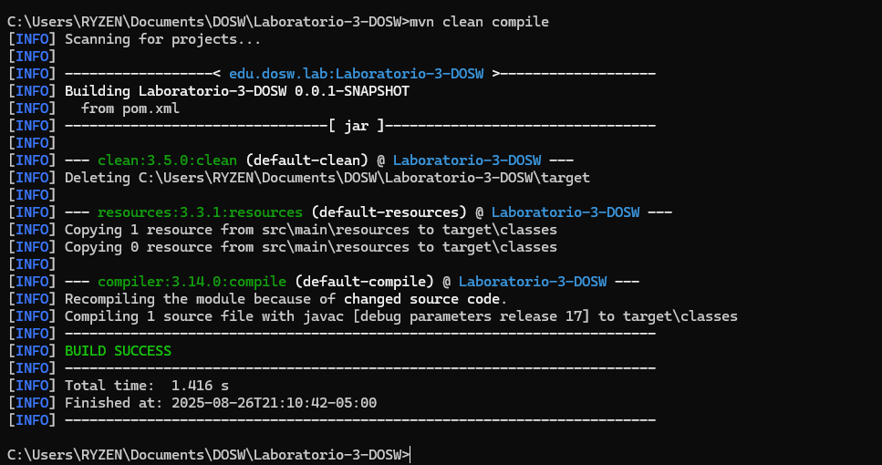
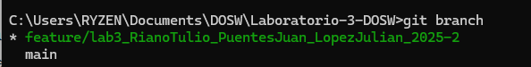

# 🧩 Laboratorio-3-DOSW

---

## 👥 Integrantes

- Julian Lopez Barrero
- Juan Sebastian Puentes Julio
- Tulio Riano Sanchez

---

## ✅ Estado del Laboratorio

La **primera parte del laboratorio es completamente funcional**.  
Incluye la configuración básica de Maven, la estructura del proyecto y la inclusion de las dependencias de JUnit 5.

---

## 🖼️ Evidencia

---
