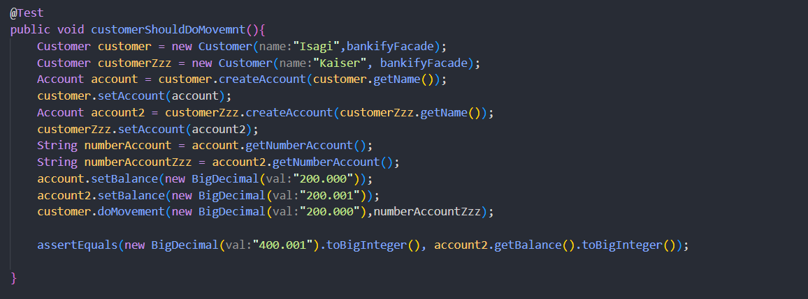

# 🧩 Laboratorio-3-DOSW

---

## 👥 Integrantes

- Julian Lopez Barrero
- Juan Sebastian Puentes Julio
- Tulio Riano Sanchez

---

## ✅ Estado del Laboratorio

La **primera parte del laboratorio es completamente funcional**.  
Incluye la configuración básica de Maven, la estructura del proyecto y la inclusion de las dependencias de JUnit 5.

---

## 🖼️ Evidencia

---

La **segunda parte del laboratorio es completamente funcional**.  
Incluye la organizacion de los directorios con archivos provisionales para que asi se vea la esctructura e igualmente se configuro el plugin de Jacoco

---

## 🖼️ Evidencia

---

### Reto 1

## Identificando Requerimientos

- Reglas de negocio: Asegurar la calidad de software, mantanibilidad aplicando metodologias agiles con cobertura de código y análisis estático.

- Funcionalidades principales: Crear y validar cuentas de los clientes, consultar saldo de una cuenta y hacer depósitos.

- Actores Principales:

  - Clientes

- Precondiciones Del Sistema:
  - Creacion de los clientes, verificar las cuentas de los clientes revisando si este cumple con los estandares delos digitos y si estan asociados a el banco, permitir la consulta del usuario junto con su saldo.

---

## Reto 2 Culminado:

- Para este diagrama identificamos el actor cliente que es capaz de realizar
  diferentes funciones como registrar una cuenta, consultar el saldo de la misma
  y hacer depositos. Todas estas funciones van encapsuladas en el contexto del banco.

### Diagrama De casos de Uso Para Cliente

### Historias De Casos De uso y su atributo de calidad

### Diagrama de Clases UML

--

### Reto 3 Culminado:

## Implementacion en codigo

**Explicacion**

- Se crearon dos clases para validar que los votos estuvieran dentro del rango establecido (fibonacci del 1 al 13) y una para validar los votos de los integrantes.

- Se siguio los principios S - O, para un buen desarrollo de software, esto se puede evidenciar en las clases previamente creadas, para el caso de O en planning poker recibe de acuerdo a una cantidad de tareas su descripcion para despues ser debatida.

## Reto 5

### Captura Inicial

- Añadiendo Mas Casos de prueba,corrigiendo el constructor de customer y añadiendo parametro nuevo a los objetos de Customer

## 

## 

### Captura Final Mas de 85% De Cobertura

- Se agrego una prueba para añadir un movimiento directamente desde la clase "customer" y es importante porque verifica la calidad de las pruebas.

## 

### Reflexion Julian Camilo Lopez Barrero
- Considero que es importante realizar pruebas a un software diseñado porque siguiendo lo principios de desarrollo dirigido por pruebas podemos garantizar un código más robusto, de alta calidad, fácil de mantener y asi podemos garantizarle al cliente calidad en el producto que este un un principio pidió.
